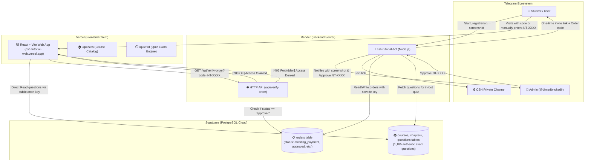

# CSH Tutorial — Complete System Architecture & Flow

This document provides a comprehensive technical overview of the **CSH Tutorial Platform**, explaining how the **Frontend**, **Backend**, **Database (Supabase)**, and **Hosting Environments (Render & Vercel)** interact to deliver a secure tutorial registration and interactive quiz system.

---

## 1. High-Level Architecture Diagram



---

## 2. Core Components

### A. The Backend: Node.js & Telegraf Bot (`/bot`)
- **Hosting:** [Render](https://render.com) (Service: `CSH_Tutorial_Web` / `csh-tutorial-bot`)
- **Runtime:** Node.js (ES Modules)
- **Role:** 
  1. Runs the Telegram bot via the `telegraf` framework.
  2. Runs a lightweight HTTP server on port 3000 for keep-alive health pings and order verification.
  3. Acts as the **authoritative gatekeeper** for user permissions and approvals.

#### Key Modules:
- `bot/src/bot.js`: Entry point, starts Telegram polling and creates the HTTP server (`/api/verify-order`).
- `bot/src/handlers/wizard.js`: Multi-step interactive registration wizard (Name → Username → Field → Plan → Payment details). Generates random, unguessable order codes (e.g. `NT-K7P4N8`).
- `bot/src/handlers/screenshot.js`: Receives payment receipts/screenshots, uploads them, updates order status to `screenshot_sent`, and notifies the admin with approve/reject buttons.
- `bot/src/handlers/admin.js`: Handles `/pending`, `/approve`, `/reject`, `/stats`, and `/resend`.
- `bot/src/handlers/quiz.js`: Full-featured in-bot quiz runner with instant feedback and explanations. Guarded so only approved students can access it.
- `bot/src/utils/delivery.js`: Generates temporary single-use Telegram channel invite links (48-hour expiration) and sends the student their approved order code and web quiz URL.

---

### B. The Frontend: React & Vite Web App (`/frontend`)
- **Hosting:** [Vercel](https://vercel.com) (`https://csh-tutorial-web.vercel.app`)
- **Framework:** React 18 + Vite + React Router DOM
- **Role:** Fast, mobile-responsive interactive web quiz platform where students practice chapter questions with real-time timers, score tracking, and detailed explanations.

#### Key Pages & Modules:
- `frontend/src/pages/QuizHome.jsx`: Lists all courses (Economics, Psychology, Geography, Logic, Physics, Math, English). Includes the Order Code verification gate.
- `frontend/src/pages/QuizRunner.jsx`: The examination interface. Displays questions, handles option selection, tracks timers, and calculates final scores.
- `frontend/src/lib/quizAccess.js`: Client-side security manager. Validates codes directly against the Render bot API (`/api/verify-order`). Stores validated session credentials in `localStorage` and cleans up rejected or expired sessions.
- `frontend/src/lib/supabase.js`: Read-only Supabase client for fetching published quiz questions.

---

### C. The Database: Supabase PostgreSQL
- **Hosting:** [Supabase](https://supabase.com)
- **Engine:** Managed PostgreSQL
- **Role:** Central persistent storage for all orders, questions, and tutorial content.

#### Schema Overview:

#### 1. `orders` Table
| Column | Type | Purpose |
| :--- | :--- | :--- |
| `id` | `uuid` | Primary Key |
| `order_code` | `text` (Unique) | Secure random code (e.g., `NT-K7P4N8`) used as access key |
| `telegram_id` | `bigint` | Telegram User ID of student |
| `telegram_username` | `text` | Username (e.g. `@student`) |
| `name` | `text` | Full student name |
| `department` | `text` | Field of study (`Natural` or `Social`) |
| `phone` | `text` | Contact phone number |
| `plan` | `text` | Subscribed plan (`sem1`, `sem2`, or `full`) |
| `price` | `integer` | Price in ETB (399 or 699) |
| `method` | `text` | Payment method (`telebirr` or `cbe`) |
| `status` | `text` | `awaiting_payment` → `screenshot_sent` → `approved` / `rejected` |
| `screenshot_file_id` | `text` | Telegram photo file ID of the payment receipt |
| `reject_reason` | `text` | Reason if payment was rejected by admin |
| `created_at` | `timestamptz` | Order creation timestamp |
| `reviewed_at` | `timestamptz` | Admin approval timestamp |

#### 2. Quiz Tables (`courses`, `chapters`, `questions`)
- **`courses`**: Stores university courses (Code, Title, Description, Semester).
- **`chapters`**: Chapters belonging to each course with sequence numbers.
- **`questions`**: Over 1,185 exam questions with:
  - `question_text`: Problem statement
  - `options`: JSON array `[{"id":"A","text":"..."},{"id":"B","text":"..."}]`
  - `correct_answer`: Correct option identifier (`A`, `B`, `C`, or `D`)
  - `explanation`: Comprehensive step-by-step reasoning
  - `difficulty`: `Easy`, `Medium`, or `Hard`

---

## 3. Detailed Data Flow & Lifecycles

### Flow 1: Registration & Payment
1. Student starts registration via `/start` in `@CSH_Tutorial_bot`.
2. Student provides their details step-by-step through the wizard.
3. The bot generates a random, collision-tested code (e.g. `NT-8K3P9Q`) and creates an order record in Supabase with `status: "awaiting_payment"`.
4. **Security Enforcement:** The bot displays payment instructions (TeleBirr / CBE account) **without revealing the order code**.

---

### Flow 2: Payment Receipt Submission
1. Student makes payment through TeleBirr or CBE.
2. Student uploads the transaction screenshot to the bot.
3. Bot updates the order in Supabase to `status: "screenshot_sent"`.
4. Student receives a confirmation message: *"Payment Receipt Received! Please wait for admin approval."* (No access code given yet).
5. Bot sends an alert to the Admin Telegram chat with:
   - Student's name, plan, and payment method
   - The receipt screenshot photo
   - Interactive buttons: `[✅ Approve]` and `[❌ Reject]`

---

### Flow 3: Admin Review & Access Delivery
1. Admin inspects the receipt and taps `✅ Approve` (or sends `/approve NT-XXXX`).
2. Bot updates Supabase: `status = "approved"`, `reviewed_at = NOW()`.
3. The bot triggers fulfillment (`deliverAccess`):
   - Generates an exclusive, single-use Telegram private channel invite link (valid for 48 hours).
   - Sends the student their **approved Order Code** (`NT-XXXX`).
   - Sends the direct web quiz link: `https://csh-tutorial-web.vercel.app/quizzes?order=NT-XXXX`.

---

### Flow 4: Web Quiz Access (Zero-Trust Security)
1. Student opens the website.
2. The web frontend extracts the order code from the URL or local storage.
3. **Live Verification:** Frontend sends a request to the backend:
   ```http
   GET https://csh-tutorial-bot.onrender.com/api/verify-order?code=NT-XXXX
   ```
4. The bot backend queries Supabase:
   - If order exists **and** `status === 'approved'` → Returns `200 OK { valid: true }`.
   - If order is missing, pending, awaiting payment, or rejected → Returns `403 Forbidden { valid: false }`.
5. Frontend unlocks the quiz dashboard only upon `200 OK`. If unapproved, the student is redirected to a locked screen.

---

### Flow 5: In-Bot Telegram Quiz Gate
1. If any user types `/quiz` or `/quizzes` in Telegram:
   - Bot queries Supabase using the user's `telegram_id`.
   - If the user is the Admin (`ADMIN_CHAT_ID`), access is granted immediately for testing.
   - If the user has an order with `status === 'approved'`, access is granted.
   - Otherwise, the bot halts execution and shows `🔒 Quiz Access Locked`, instructing the student to register and wait for approval.

---

## 4. Hosting & Deployment Setup

| Service | Provider | Purpose | Configuration |
| :--- | :--- | :--- | :--- |
| **Frontend** | Vercel | Hosts React Single Page Application | Auto-deploys on `git push` to `main` branch |
| **Backend** | Render | Hosts Node.js Telegraf Bot & HTTP API | Connected to GitHub repo (`bot` directory) |
| **Database** | Supabase | Managed PostgreSQL, Auth, and Storage | Accessed via `@supabase/supabase-js` |
| **Repository** | GitHub | Version control (`nahom-je/CSH_Tutorial_Web`) | Single source of truth for both web and bot |

---

## 5. Environment Variables Reference

### Backend (Render Environment)
- `BOT_TOKEN`: Telegram bot token from @BotFather
- `ADMIN_CHAT_ID`: Telegram user/chat ID of the administrator
- `TELEBIRR_NUMBER`: TeleBirr account number for receiving payments
- `CBE_ACCOUNT`: CBE bank account number
- `ACCOUNT_HOLDER_NAME`: Full name registered on payment accounts
- `PRIVATE_CHANNEL_ID`: Telegram ID of the private tutorial channel
- `SUPABASE_URL`: Supabase project URL (`https://xyz.supabase.co`)
- `SUPABASE_SERVICE_KEY`: Service-role key for backend read/write operations
- `QUIZ_PLATFORM_URL`: Public web URL (`https://csh-tutorial-web.vercel.app/quizzes`)

### Frontend (Vercel Environment)
- `VITE_SUPABASE_URL`: Supabase project URL
- `VITE_SUPABASE_ANON_KEY`: Supabase public anonymous key (read-only for questions)
- `VITE_BOT_API_URL`: Render backend URL for order verification (`https://csh-tutorial-bot.onrender.com`)
